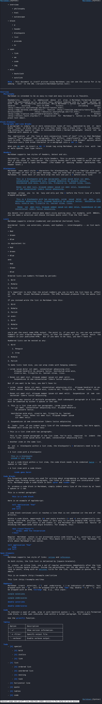

# ts-md2man
> Tree-sitter based markdown to manual page converter.

## Requirements
* [tbsp code generator](https://github.com/agvxov/tbsp)
* C compiler
* lib pcre
* lib tree-sitter & tree-sitter-markdown

## Supports
* italics/bold/code
* code blocks
* star/plus/minus/ordered lists with nesting
* checked/unckecked tasks
* links
* horizontal line
* quotes
* tables

## Demo

The input is [test/max.md](test/max.md).

## Notes
Level 1 headings are translated to `.TH`-s.
Text not below any `.TH` renders without subheadings and left margins.
Always having a level 1 heading at the top of your markdown manual is highly recommended.

Man pages can only facillitate headings 1-3,
so anything below will just become its own paragraph.

Definitions and strikethrough will render as plaintext
because there is no known better way to represent them in a manual.

Tables will always be fully boxed (all cells are separeted with lines).

Id-links will render as their visible text.

The limit on nesting ordered lists is 4,
where the least indented ordered list counts as the 1st level of nesting.

Nested quotes are not supported due to the way tree-sitter-markdown parses them.

Quotes can contain markdown and works fine with bold and such,
however headers will escape out of the quote context.

Quotes could look significantly better with a vertical line infront.
The closest i got is [quote.groff](tool/quote.groff).
If anyone knows how to make it work, let me know.

This project is mainly a test for tbsp's usability.
